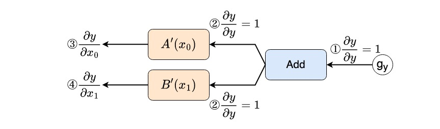

# zerodeep

ゼロから作るDeep Learning3 フレームワーク編のレポジトリ
 

## 実行環境
Python 3.7.10 
numpy == 1.20.3 
matplotlib == 3.5.1 

## 公式リポジトリ
https://github.com/oreilly-japan/deep-learning-from-scratch-3
 

## ファイル構成
各プログラムは以下のページと対応しています。 

|ファイル名|ページ数|ステップ|
|:--:|:--:|:--:|
|[stage1.ipynb](/stage1.ipynb)|pp.3-66|ステップ1~ステップ10|
|[stage2.ipynb](/stage2.ipynb)|pp.69-177|ステップ11~ステップ24|

